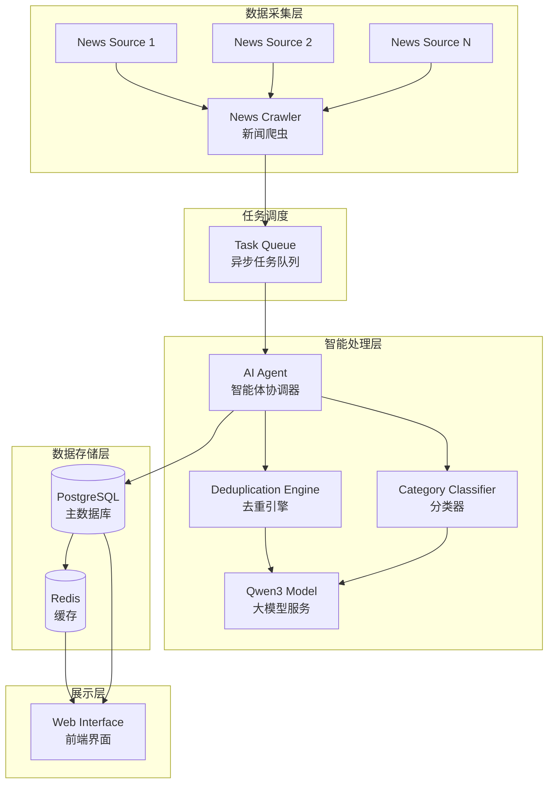
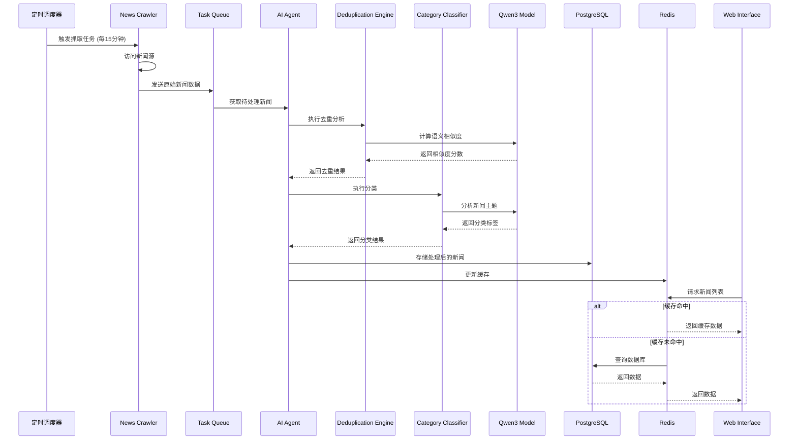
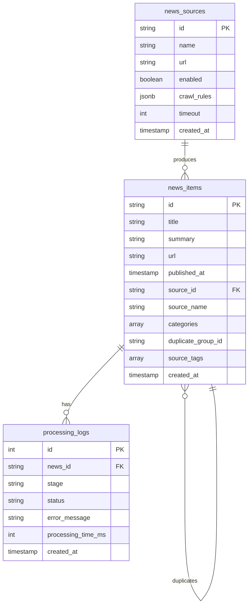

# 设计文档

## 概述

"one"智能新闻聚合平台是一个基于大模型的新闻处理系统，通过智能体协调多个模块完成新闻的抓取、去重、分类和展示。系统采用 LangChain 框架构建智能体，使用阿里百炼平台的 Qwen3 模型进行语义分析，实现高质量的新闻聚合服务。

### 核心目标

- 自动化新闻采集：从多个新闻源定期抓取最新内容
- 智能去重：使用大模型识别语义相似的重复新闻
- 主题分类：自动将新闻分配到合适的主题类别
- 统一展示：提供简洁美观的网页界面

### 技术架构概览

系统采用微服务架构，主要包含以下层次：

- **数据采集层**: 新闻爬虫模块，负责从配置的新闻源抓取内容
- **智能处理层**: AI 智能体协调去重引擎和分类器进行内容分析
- **数据存储层**: PostgreSQL 存储结构化数据，Redis 提供缓存支持
- **展示层**: Web 前端提供用户交互界面

## 架构设计

### 系统架构图



### 模块职责

#### 1. News Crawler (新闻爬虫)
- 根据配置的新闻源列表定期抓取新闻
- 解析网页内容，提取标题、摘要、链接、发布时间
- 处理抓取失败和超时情况
- 将抓取结果发送到任务队列

#### 2. AI Agent (智能体协调器)
- 使用 LangChain 框架构建
- 协调新闻处理流程：抓取 → 去重 → 分类 → 存储
- 维护处理队列，确保顺序处理
- 生成统计报告
- 处理异常和降级策略

#### 3. Deduplication Engine (去重引擎)
- 调用 Qwen3 模型计算新闻语义相似度
- 识别相似度超过 85% 的重复新闻
- 合并重复新闻的来源标签
- 保留最早发布的新闻作为主条目

#### 4. Category Classifier (分类器)
- 调用 Qwen3 模型分析新闻主题
- 支持多标签分类（最多 3 个类别）
- 预定义类别：金融、科技、体育、娱乐、政治、健康

#### 5. Web Interface (网页界面)
- 响应式设计，支持桌面和移动设备
- 卡片式新闻展示
- 主题筛选导航
- 多来源标注和跳转

### 数据流



## 组件和接口

### 核心组件

#### NewsSource (新闻源配置)

```python
from dataclasses import dataclass
from typing import Dict, Optional

@dataclass
class NewsSource:
    """新闻源配置"""
    id: str
    name: str
    url: str
    enabled: bool
    crawl_rules: Dict[str, str]  # CSS选择器或XPath规则
    timeout: int = 30  # 超时时间（秒）
    
    def validate_url(self) -> bool:
        """验证URL有效性"""
        pass
```

#### NewsItem (新闻条目)

```python
from dataclasses import dataclass
from datetime import datetime
from typing import List, Optional

@dataclass
class NewsItem:
    """新闻条目"""
    id: str
    title: str
    summary: str
    url: str
    published_at: datetime
    source_id: str
    source_name: str
    categories: List[str]  # 主题分类
    duplicate_group_id: Optional[str]  # 去重组ID
    source_tags: List[str]  # 所有来源标签
    created_at: datetime
    
    def is_duplicate_of(self, other: 'NewsItem', threshold: float = 0.85) -> bool:
        """判断是否为重复新闻"""
        pass
```

#### NewsCrawler (新闻爬虫)

```python
from typing import List
import asyncio

class NewsCrawler:
    """新闻爬虫模块"""
    
    def __init__(self, sources: List[NewsSource]):
        self.sources = sources
        self.timeout = 30
    
    async def crawl_all(self) -> List[NewsItem]:
        """抓取所有启用的新闻源"""
        tasks = [self.crawl_source(source) for source in self.sources if source.enabled]
        results = await asyncio.gather(*tasks, return_exceptions=True)
        return self._flatten_results(results)
    
    async def crawl_source(self, source: NewsSource) -> List[NewsItem]:
        """抓取单个新闻源"""
        pass
    
    def _flatten_results(self, results: List) -> List[NewsItem]:
        """展平结果并过滤异常"""
        pass
```

#### DeduplicationEngine (去重引擎)

```python
from typing import List, Tuple

class DeduplicationEngine:
    """新闻去重引擎"""
    
    def __init__(self, llm_client, similarity_threshold: float = 0.85):
        self.llm_client = llm_client
        self.threshold = similarity_threshold
        self.max_processing_time = 5  # 秒
    
    async def find_duplicates(self, news_item: NewsItem, existing_items: List[NewsItem]) -> List[str]:
        """查找重复新闻，返回重复新闻的ID列表"""
        pass
    
    async def calculate_similarity(self, item1: NewsItem, item2: NewsItem) -> float:
        """使用大模型计算两条新闻的语义相似度"""
        pass
    
    def merge_duplicates(self, primary: NewsItem, duplicates: List[NewsItem]) -> NewsItem:
        """合并重复新闻，保留最早发布的作为主条目"""
        pass
```

#### CategoryClassifier (分类器)

```python
from typing import List

class CategoryClassifier:
    """新闻分类器"""
    
    CATEGORIES = ["金融", "科技", "体育", "娱乐", "政治", "健康"]
    MAX_CATEGORIES = 3
    MAX_PROCESSING_TIME = 3  # 秒
    
    def __init__(self, llm_client):
        self.llm_client = llm_client
    
    async def classify(self, news_item: NewsItem) -> List[str]:
        """分类新闻，返回1-3个类别标签"""
        pass
    
    def _validate_categories(self, categories: List[str]) -> List[str]:
        """验证并限制类别数量"""
        pass
```

#### AIAgent (智能体协调器)

```python
from langchain.agents import Agent
from typing import List, Dict

class NewsAggregatorAgent:
    """新闻聚合智能体"""
    
    def __init__(self, crawler: NewsCrawler, dedup_engine: DeduplicationEngine, 
                 classifier: CategoryClassifier, db_client, cache_client):
        self.crawler = crawler
        self.dedup_engine = dedup_engine
        self.classifier = classifier
        self.db = db_client
        self.cache = cache_client
        self.processing_queue = []
    
    async def process_news_cycle(self):
        """执行完整的新闻处理周期"""
        # 1. 抓取新闻
        raw_news = await self.crawler.crawl_all()
        
        # 2. 加入处理队列
        self.processing_queue.extend(raw_news)
        
        # 3. 按顺序处理
        for news_item in self.processing_queue:
            try:
                await self._process_single_news(news_item)
            except Exception as e:
                self._log_error(news_item, e)
                continue
        
        # 4. 生成统计报告
        self._generate_statistics()
    
    async def _process_single_news(self, news_item: NewsItem):
        """处理单条新闻：去重 → 分类 → 存储"""
        # 去重
        existing_news = await self.db.get_recent_news()
        duplicates = await self.dedup_engine.find_duplicates(news_item, existing_news)
        
        if duplicates:
            primary = await self.db.get_news_by_id(duplicates[0])
            merged = self.dedup_engine.merge_duplicates(primary, [news_item])
            await self.db.update_news(merged)
        else:
            # 分类
            categories = await self.classifier.classify(news_item)
            news_item.categories = categories
            
            # 存储
            await self.db.insert_news(news_item)
        
        # 更新缓存
        await self.cache.invalidate_news_cache()
    
    def _generate_statistics(self) -> Dict:
        """生成处理统计报告"""
        pass
    
    def _log_error(self, news_item: NewsItem, error: Exception):
        """记录错误日志"""
        pass
```

### 外部接口

#### 大模型服务接口

```python
from typing import List, Dict

class QwenLLMClient:
    """阿里百炼平台 Qwen3 模型客户端"""
    
    def __init__(self, api_key: str, endpoint: str):
        self.api_key = api_key
        self.endpoint = endpoint
        self.call_count = 0
        self.total_response_time = 0
    
    async def calculate_similarity(self, text1: str, text2: str) -> float:
        """计算两段文本的语义相似度"""
        prompt = f"""请分析以下两条新闻的相似度，返回0-1之间的分数。
        
新闻1: {text1}
新闻2: {text2}

只返回数字分数，不要其他内容。"""
        
        response = await self._call_api(prompt)
        return float(response)
    
    async def classify_news(self, title: str, summary: str, categories: List[str]) -> List[str]:
        """对新闻进行主题分类"""
        prompt = f"""请将以下新闻分类到合适的主题中，可以选择1-3个类别。

新闻标题: {title}
新闻摘要: {summary}

可选类别: {', '.join(categories)}

返回JSON格式: {{"categories": ["类别1", "类别2"]}}"""
        
        response = await self._call_api(prompt)
        return self._parse_categories(response)
    
    async def _call_api(self, prompt: str) -> str:
        """调用大模型API"""
        pass
    
    def _parse_categories(self, response: str) -> List[str]:
        """解析分类结果"""
        pass
    
    def get_metrics(self) -> Dict:
        """获取API调用指标"""
        return {
            "call_count": self.call_count,
            "avg_response_time": self.total_response_time / max(self.call_count, 1)
        }
```

#### Web API 接口

```python
from fastapi import FastAPI, Query
from typing import List, Optional

app = FastAPI()

@app.get("/api/news")
async def get_news_list(
    category: Optional[str] = None,
    page: int = Query(1, ge=1),
    page_size: int = Query(20, ge=1, le=100)
) -> Dict:
    """获取新闻列表"""
    pass

@app.get("/api/news/{news_id}")
async def get_news_detail(news_id: str) -> Dict:
    """获取新闻详情"""
    pass

@app.get("/api/categories")
async def get_categories() -> List[str]:
    """获取所有分类"""
    pass

@app.get("/api/health")
async def health_check() -> Dict:
    """健康检查接口"""
    pass

@app.get("/api/statistics")
async def get_statistics() -> Dict:
    """获取系统统计信息"""
    pass
```

## 数据模型

### 数据库设计

#### news_sources 表（新闻源配置）

```sql
CREATE TABLE news_sources (
    id VARCHAR(36) PRIMARY KEY,
    name VARCHAR(255) NOT NULL,
    url TEXT NOT NULL,
    enabled BOOLEAN DEFAULT TRUE,
    crawl_rules JSONB NOT NULL,
    timeout INTEGER DEFAULT 30,
    created_at TIMESTAMP DEFAULT CURRENT_TIMESTAMP,
    updated_at TIMESTAMP DEFAULT CURRENT_TIMESTAMP
);

CREATE INDEX idx_news_sources_enabled ON news_sources(enabled);
```

#### news_items 表（新闻条目）

```sql
CREATE TABLE news_items (
    id VARCHAR(36) PRIMARY KEY,
    title TEXT NOT NULL,
    summary TEXT,
    url TEXT NOT NULL,
    published_at TIMESTAMP NOT NULL,
    source_id VARCHAR(36) REFERENCES news_sources(id),
    source_name VARCHAR(255) NOT NULL,
    categories TEXT[] NOT NULL,
    duplicate_group_id VARCHAR(36),
    source_tags TEXT[] NOT NULL,
    created_at TIMESTAMP DEFAULT CURRENT_TIMESTAMP,
    updated_at TIMESTAMP DEFAULT CURRENT_TIMESTAMP
);

CREATE INDEX idx_news_items_published_at ON news_items(published_at DESC);
CREATE INDEX idx_news_items_categories ON news_items USING GIN(categories);
CREATE INDEX idx_news_items_duplicate_group ON news_items(duplicate_group_id);
CREATE INDEX idx_news_items_created_at ON news_items(created_at DESC);
```

#### processing_logs 表（处理日志）

```sql
CREATE TABLE processing_logs (
    id SERIAL PRIMARY KEY,
    news_id VARCHAR(36),
    stage VARCHAR(50) NOT NULL,  -- 'crawl', 'dedup', 'classify', 'store'
    status VARCHAR(20) NOT NULL,  -- 'success', 'failure'
    error_message TEXT,
    processing_time_ms INTEGER,
    created_at TIMESTAMP DEFAULT CURRENT_TIMESTAMP
);

CREATE INDEX idx_processing_logs_news_id ON processing_logs(news_id);
CREATE INDEX idx_processing_logs_created_at ON processing_logs(created_at DESC);
```

#### system_metrics 表（系统指标）

```sql
CREATE TABLE system_metrics (
    id SERIAL PRIMARY KEY,
    metric_type VARCHAR(50) NOT NULL,  -- 'crawl_count', 'dedup_count', 'api_calls'
    metric_value INTEGER NOT NULL,
    metadata JSONB,
    recorded_at TIMESTAMP DEFAULT CURRENT_TIMESTAMP
);

CREATE INDEX idx_system_metrics_type_time ON system_metrics(metric_type, recorded_at DESC);
```

### Redis 缓存结构

```python
# 缓存键设计
CACHE_KEYS = {
    "news_list": "news:list:{category}:{page}",  # 新闻列表缓存
    "news_detail": "news:detail:{news_id}",      # 新闻详情缓存
    "categories": "news:categories",              # 分类列表缓存
    "statistics": "news:statistics",              # 统计信息缓存
}

# 缓存过期时间
CACHE_TTL = {
    "news_list": 300,      # 5分钟
    "news_detail": 3600,   # 1小时
    "categories": 86400,   # 24小时
    "statistics": 600,     # 10分钟
}
```

### 数据关系图




## 正确性属性

*属性是指在系统所有有效执行中都应该成立的特征或行为——本质上是关于系统应该做什么的形式化陈述。属性是人类可读规范和机器可验证正确性保证之间的桥梁。*

### 属性 1: 新闻源配置往返保持完整性

*对于任何*新闻源配置（包含名称、URL和抓取规则），将其添加到系统后再检索，应该得到包含所有原始字段的相同配置。

**验证需求: 1.1, 1.2**

### 属性 2: URL 验证正确分类有效和无效输入

*对于任何*URL字符串，系统应该正确识别其是否为有效URL，接受符合URL规范的输入，拒绝不符合规范的输入。

**验证需求: 1.3**

### 属性 3: 新闻源启用状态切换保持一致性

*对于任何*新闻源，切换其启用/禁用状态后，查询该新闻源应该反映最新的状态值。

**验证需求: 1.4**

### 属性 4: 抓取任务仅访问已启用的新闻源

*对于任何*新闻源配置集合，执行抓取任务时，应该只处理启用状态为true的新闻源，不处理禁用的新闻源。

**验证需求: 2.1**

### 属性 5: 抓取的新闻包含所有必需字段

*对于任何*成功抓取的新闻条目，其数据应该包含标题、摘要、链接和发布时间这四个必需字段，且字段值非空。

**验证需求: 2.2**

### 属性 6: 抓取失败不影响其他新闻源处理

*对于任何*新闻源集合，如果其中某个源抓取失败，系统应该记录该错误并继续处理剩余的新闻源，最终返回其他源的抓取结果。

**验证需求: 2.3**

### 属性 7: 去重引擎根据相似度阈值正确判断重复

*对于任何*两条新闻和它们的相似度分数，当相似度大于等于85%时，系统应该将它们标记为重复；当相似度小于85%时，不应标记为重复。

**验证需求: 3.2**

### 属性 8: 重复新闻合并保留最早发布时间并合并来源

*对于任何*一组被识别为重复的新闻，合并后的主条目应该使用发布时间最早的新闻作为基础，并且包含所有重复新闻的来源标签。

**验证需求: 3.3, 3.4**

### 属性 9: 新闻分类结果在有效范围内

*对于任何*新闻条目，分类器返回的类别列表应该至少包含1个类别，最多包含3个类别，且所有类别都在预定义的类别集合中（金融、科技、体育、娱乐、政治、健康）。

**验证需求: 4.2, 4.3, 4.4**

### 属性 10: 智能体按正确顺序执行处理流程

*对于任何*新闻条目，智能体的处理流程应该按照"抓取 → 去重 → 分类 → 存储"的顺序执行，且每个步骤完成后才能进入下一步骤。

**验证需求: 5.1, 5.2**

### 属性 11: 单个新闻处理失败不影响其他新闻

*对于任何*新闻条目列表，如果其中某条新闻在处理过程中失败，系统应该记录该错误并继续处理列表中的其他新闻。

**验证需求: 5.3**

### 属性 12: 处理队列保持接收顺序

*对于任何*按顺序接收的新闻序列，处理这些新闻的顺序应该与接收顺序一致。

**验证需求: 5.4**

### 属性 13: 新闻卡片渲染包含所有必需信息

*对于任何*新闻条目，其渲染后的HTML应该包含标题、摘要、发布时间和来源标签这些信息。

**验证需求: 6.1**

### 属性 14: 多来源新闻显示来源数量标记

*对于任何*具有多个来源标签的新闻条目，其渲染结果应该包含显示来源数量的数字标记。

**验证需求: 6.3**

### 属性 15: 多来源新闻默认链接指向最早来源

*对于任何*具有多个来源的新闻条目，其默认链接应该指向发布时间最早的来源URL。

**验证需求: 7.2**

### 属性 16: 新闻数据持久化往返保持完整性

*对于任何*新闻条目，将其存储到数据库后再检索，应该得到包含所有字段（标题、摘要、链接、发布时间、来源、分类、去重关系）的相同数据。

**验证需求: 8.1, 8.2**

### 属性 17: 数据保留策略正确处理时间边界

*对于任何*新闻条目，如果其发布时间在最近30天内，应该能够从数据库中检索到；如果超过30天，可能被归档或删除。

**验证需求: 8.3, 8.4**

### 属性 18: 查询结果符合过滤条件

*对于任何*查询条件（时间范围、分类、关键词），返回的新闻列表中的每条新闻都应该满足该查询条件。

**验证需求: 8.5**

### 属性 19: 错误发生时记录完整日志信息

*对于任何*系统错误，生成的错误日志应该包含时间戳、错误类型和堆栈信息这三个必需字段。

**验证需求: 9.1**

### 属性 20: 连续失败达到阈值触发告警

*对于任何*新闻源，如果其连续抓取失败次数达到3次，系统应该生成并发送告警通知。

**验证需求: 9.2**

### 属性 21: API 调用统计正确记录

*对于任何*大模型API调用，系统应该记录该调用的次数和响应时间，且统计数据应该可以被查询。

**验证需求: 9.4**

### 属性 22: API 失败时启用降级策略

*对于任何*大模型API调用失败的情况，系统应该切换到降级策略（基于关键词的去重和分类），而不是完全失败。

**验证需求: 9.5**

### 属性 23: 缓存命中减少数据库查询

*对于任何*相同的查询请求，第二次查询应该从缓存获取数据，而不是再次访问数据库。

**验证需求: 10.4**

## 错误处理

### 错误分类

系统错误分为以下几类：

1. **网络错误**: 新闻源不可访问、超时、DNS解析失败
2. **解析错误**: 网页结构变化导致无法提取新闻内容
3. **API错误**: 大模型服务调用失败、配额超限、响应格式错误
4. **数据错误**: 数据验证失败、数据库操作失败
5. **系统错误**: 内存不足、磁盘空间不足、服务崩溃

### 错误处理策略

#### 1. 新闻抓取错误

```python
class CrawlErrorHandler:
    """抓取错误处理器"""
    
    async def handle_crawl_error(self, source: NewsSource, error: Exception):
        """处理抓取错误"""
        # 记录错误日志
        await self.log_error(source.id, "crawl", error)
        
        # 更新失败计数
        failure_count = await self.increment_failure_count(source.id)
        
        # 连续3次失败发送告警
        if failure_count >= 3:
            await self.send_alert(f"新闻源 {source.name} 连续{failure_count}次抓取失败")
        
        # 不中断其他源的处理
        return None
```

#### 2. 大模型API错误

```python
class LLMErrorHandler:
    """大模型API错误处理器"""
    
    async def handle_api_error(self, operation: str, error: Exception):
        """处理API错误，启用降级策略"""
        # 记录错误
        await self.log_error("llm_api", operation, error)
        
        # 根据操作类型选择降级策略
        if operation == "deduplication":
            return self.fallback_deduplication()
        elif operation == "classification":
            return self.fallback_classification()
    
    def fallback_deduplication(self) -> DeduplicationStrategy:
        """降级去重策略：基于标题相似度"""
        return TitleBasedDeduplication(threshold=0.9)
    
    def fallback_classification(self) -> ClassificationStrategy:
        """降级分类策略：基于关键词匹配"""
        return KeywordBasedClassification()
```

#### 3. 数据库错误

```python
class DatabaseErrorHandler:
    """数据库错误处理器"""
    
    async def handle_db_error(self, operation: str, error: Exception):
        """处理数据库错误"""
        # 记录错误
        await self.log_error("database", operation, error)
        
        # 根据错误类型决定重试策略
        if isinstance(error, ConnectionError):
            # 连接错误：重试3次
            return await self.retry_with_backoff(operation, max_retries=3)
        elif isinstance(error, IntegrityError):
            # 完整性错误：不重试，记录并跳过
            await self.log_warning(f"数据完整性错误: {error}")
            return None
        else:
            # 其他错误：重试1次
            return await self.retry_with_backoff(operation, max_retries=1)
```

### 错误日志格式

```python
@dataclass
class ErrorLog:
    """错误日志结构"""
    timestamp: datetime
    error_type: str  # 'network', 'parse', 'api', 'database', 'system'
    component: str   # 'crawler', 'dedup', 'classifier', 'agent'
    operation: str
    error_message: str
    stack_trace: str
    context: Dict[str, Any]  # 额外的上下文信息
```

### 监控和告警

#### 告警规则

1. **新闻源连续失败**: 任何新闻源连续3次抓取失败
2. **API配额告警**: 大模型API调用次数超过每日配额的80%
3. **处理延迟告警**: 新闻处理队列积压超过1000条
4. **数据库连接告警**: 数据库连接池使用率超过90%
5. **磁盘空间告警**: 数据库磁盘使用率超过85%

#### 健康检查接口

```python
@app.get("/api/health")
async def health_check() -> Dict:
    """系统健康检查"""
    return {
        "status": "healthy",  # 'healthy', 'degraded', 'unhealthy'
        "timestamp": datetime.now().isoformat(),
        "components": {
            "crawler": await check_crawler_health(),
            "database": await check_database_health(),
            "cache": await check_cache_health(),
            "llm_api": await check_llm_api_health(),
        },
        "metrics": {
            "active_sources": await count_active_sources(),
            "processing_queue_size": await get_queue_size(),
            "api_calls_today": await get_api_call_count(),
            "cache_hit_rate": await get_cache_hit_rate(),
        }
    }
```

## 测试策略

### 测试方法概述

本项目采用双重测试方法，结合单元测试和基于属性的测试（Property-Based Testing, PBT），以确保全面的代码覆盖和正确性验证。

- **单元测试**: 验证特定示例、边界情况和错误条件
- **属性测试**: 通过随机生成的输入验证通用属性，确保系统在各种情况下的正确性

两种测试方法互补：单元测试捕获具体的错误场景，属性测试验证通用的正确性保证。

### 基于属性的测试配置

#### 测试框架选择

- **Python**: 使用 `hypothesis` 库进行属性测试
- **最小迭代次数**: 每个属性测试至少运行 100 次
- **标签格式**: 每个测试必须引用设计文档中的属性

```python
from hypothesis import given, settings
import hypothesis.strategies as st

# 配置：每个测试至少100次迭代
@settings(max_examples=100)
@given(news_source=st.builds(NewsSource, ...))
def test_property_1_news_source_roundtrip(news_source):
    """
    Feature: news-aggregator-one, Property 1: 新闻源配置往返保持完整性
    """
    # 测试实现
    pass
```

### 测试组织结构

```
tests/
├── unit/                          # 单元测试
│   ├── test_crawler.py
│   ├── test_deduplication.py
│   ├── test_classification.py
│   ├── test_agent.py
│   └── test_web_interface.py
├── property/                      # 属性测试
│   ├── test_properties_config.py      # 属性1-4: 配置管理
│   ├── test_properties_crawl.py       # 属性5-6: 新闻抓取
│   ├── test_properties_dedup.py       # 属性7-8: 去重
│   ├── test_properties_classify.py    # 属性9: 分类
│   ├── test_properties_agent.py       # 属性10-12: 智能体协调
│   ├── test_properties_web.py         # 属性13-15: Web界面
│   ├── test_properties_storage.py     # 属性16-18: 数据存储
│   └── test_properties_monitoring.py  # 属性19-23: 监控和错误处理
├── integration/                   # 集成测试
│   ├── test_end_to_end.py
│   └── test_llm_integration.py
└── fixtures/                      # 测试数据和模拟
    ├── mock_news_sources.py
    ├── mock_llm_responses.py
    └── sample_news_data.py
```

### 属性测试示例

#### 示例 1: 新闻源配置往返测试

```python
from hypothesis import given, settings
import hypothesis.strategies as st
from models import NewsSource

@settings(max_examples=100)
@given(
    name=st.text(min_size=1, max_size=100),
    url=st.from_regex(r'https?://[a-z0-9\-\.]+\.[a-z]{2,}', fullmatch=True),
    crawl_rules=st.dictionaries(
        keys=st.sampled_from(['title', 'summary', 'link']),
        values=st.text(min_size=1)
    )
)
def test_property_1_news_source_roundtrip(name, url, crawl_rules):
    """
    Feature: news-aggregator-one, Property 1: 新闻源配置往返保持完整性
    """
    # 创建新闻源配置
    source = NewsSource(
        id=generate_id(),
        name=name,
        url=url,
        enabled=True,
        crawl_rules=crawl_rules
    )
    
    # 存储到数据库
    db.save_news_source(source)
    
    # 从数据库检索
    retrieved = db.get_news_source(source.id)
    
    # 验证所有字段一致
    assert retrieved.name == source.name
    assert retrieved.url == source.url
    assert retrieved.crawl_rules == source.crawl_rules
    assert retrieved.enabled == source.enabled
```

#### 示例 2: 去重阈值测试

```python
@settings(max_examples=100)
@given(
    similarity=st.floats(min_value=0.0, max_value=1.0)
)
def test_property_7_deduplication_threshold(similarity):
    """
    Feature: news-aggregator-one, Property 7: 去重引擎根据相似度阈值正确判断重复
    """
    # 创建两条新闻
    news1 = create_sample_news()
    news2 = create_sample_news()
    
    # 模拟相似度计算
    with mock.patch.object(DeduplicationEngine, 'calculate_similarity', return_value=similarity):
        engine = DeduplicationEngine(llm_client=mock_llm)
        is_duplicate = engine.is_duplicate(news1, news2)
    
    # 验证阈值逻辑
    if similarity >= 0.85:
        assert is_duplicate is True
    else:
        assert is_duplicate is False
```

#### 示例 3: 分类数量约束测试

```python
@settings(max_examples=100)
@given(
    title=st.text(min_size=10, max_size=200),
    summary=st.text(min_size=50, max_size=500)
)
def test_property_9_classification_constraints(title, summary):
    """
    Feature: news-aggregator-one, Property 9: 新闻分类结果在有效范围内
    """
    news_item = NewsItem(
        id=generate_id(),
        title=title,
        summary=summary,
        url="https://example.com",
        published_at=datetime.now(),
        source_id="test_source",
        source_name="Test Source"
    )
    
    classifier = CategoryClassifier(llm_client=mock_llm)
    categories = await classifier.classify(news_item)
    
    # 验证约束
    assert len(categories) >= 1, "至少应有1个类别"
    assert len(categories) <= 3, "最多应有3个类别"
    
    valid_categories = {"金融", "科技", "体育", "娱乐", "政治", "健康"}
    for category in categories:
        assert category in valid_categories, f"类别 {category} 不在有效集合中"
```

### 单元测试策略

单元测试专注于以下方面：

1. **具体示例**: 测试已知输入和预期输出的特定场景
2. **边界情况**: 空输入、极大值、特殊字符等
3. **错误条件**: 异常处理、超时、网络错误等
4. **集成点**: 模块间的交互和数据传递

#### 单元测试示例

```python
import pytest
from unittest.mock import Mock, patch

def test_crawler_timeout():
    """测试抓取超时处理"""
    source = NewsSource(
        id="test_source",
        name="Test Source",
        url="https://slow-website.com",
        enabled=True,
        crawl_rules={},
        timeout=1  # 1秒超时
    )
    
    crawler = NewsCrawler([source])
    
    with patch('httpx.AsyncClient.get', side_effect=asyncio.TimeoutError()):
        result = await crawler.crawl_source(source)
        
        # 应该返回空列表，不抛出异常
        assert result == []
        
        # 应该记录错误日志
        assert len(error_logs) > 0
        assert error_logs[-1].error_type == "network"

def test_empty_news_list():
    """测试空新闻列表的处理"""
    agent = NewsAggregatorAgent(...)
    agent.processing_queue = []
    
    await agent.process_news_cycle()
    
    # 不应该抛出异常
    # 统计报告应该显示0条处理
    stats = agent._generate_statistics()
    assert stats['processed_count'] == 0

def test_llm_api_fallback():
    """测试大模型API失败时的降级策略"""
    with patch.object(QwenLLMClient, '_call_api', side_effect=APIError("Service unavailable")):
        engine = DeduplicationEngine(llm_client=qwen_client)
        
        # 应该使用降级策略
        result = await engine.find_duplicates(news_item, existing_news)
        
        # 验证使用了基于标题的简单去重
        assert engine.current_strategy == "title_based"
```

### 集成测试

集成测试验证整个系统的端到端流程：

```python
@pytest.mark.integration
async def test_end_to_end_news_processing():
    """端到端测试：从抓取到展示"""
    # 1. 配置新闻源
    source = await setup_test_news_source()
    
    # 2. 触发抓取
    crawler = NewsCrawler([source])
    raw_news = await crawler.crawl_all()
    assert len(raw_news) > 0
    
    # 3. 智能体处理
    agent = NewsAggregatorAgent(...)
    await agent.process_news_cycle()
    
    # 4. 验证数据库存储
    stored_news = await db.get_recent_news()
    assert len(stored_news) > 0
    
    # 5. 验证Web API
    response = await client.get("/api/news")
    assert response.status_code == 200
    assert len(response.json()['items']) > 0
```

### 测试覆盖率目标

- **代码覆盖率**: 最低 80%
- **属性测试覆盖**: 所有23个正确性属性必须有对应的属性测试
- **关键路径覆盖**: 100%（抓取、去重、分类、存储的主流程）

### 持续集成

```yaml
# .github/workflows/test.yml
name: Test Suite

on: [push, pull_request]

jobs:
  test:
    runs-on: ubuntu-latest
    steps:
      - uses: actions/checkout@v2
      
      - name: Set up Python
        uses: actions/setup-python@v2
        with:
          python-version: '3.11'
      
      - name: Install dependencies
        run: |
          pip install -r requirements.txt
          pip install -r requirements-dev.txt
      
      - name: Run unit tests
        run: pytest tests/unit/ -v
      
      - name: Run property tests
        run: pytest tests/property/ -v --hypothesis-show-statistics
      
      - name: Run integration tests
        run: pytest tests/integration/ -v
      
      - name: Generate coverage report
        run: pytest --cov=src --cov-report=html --cov-report=term
      
      - name: Check coverage threshold
        run: |
          coverage report --fail-under=80
```

### 性能测试

虽然不在属性测试范围内，但需要单独进行性能测试：

```python
@pytest.mark.performance
def test_crawler_performance():
    """测试抓取性能：30秒内完成单个源"""
    source = create_test_source()
    crawler = NewsCrawler([source])
    
    start_time = time.time()
    result = await crawler.crawl_source(source)
    elapsed = time.time() - start_time
    
    assert elapsed < 30, f"抓取耗时 {elapsed}秒，超过30秒限制"

@pytest.mark.performance
def test_deduplication_performance():
    """测试去重性能：5秒内完成单条新闻"""
    engine = DeduplicationEngine(llm_client=qwen_client)
    news_item = create_sample_news()
    existing_news = [create_sample_news() for _ in range(100)]
    
    start_time = time.time()
    result = await engine.find_duplicates(news_item, existing_news)
    elapsed = time.time() - start_time
    
    assert elapsed < 5, f"去重耗时 {elapsed}秒，超过5秒限制"
```

---

## 总结

本设计文档详细描述了"one"智能新闻聚合平台的架构、组件、接口和数据模型。系统采用模块化设计，通过LangChain智能体协调各个处理模块，使用阿里百炼平台的Qwen3模型提供智能分析能力。

关键设计决策：

1. **异步处理**: 使用Python异步编程和任务队列处理大量新闻
2. **智能体协调**: LangChain框架管理复杂的处理流程
3. **降级策略**: 大模型API失败时自动切换到基于规则的方法
4. **缓存优化**: Redis缓存减少数据库压力，提升响应速度
5. **错误容错**: 单点失败不影响整体系统运行

测试策略结合了单元测试和基于属性的测试，确保系统在各种情况下的正确性和鲁棒性。23个正确性属性覆盖了所有核心功能需求，为系统质量提供了形式化保证。
